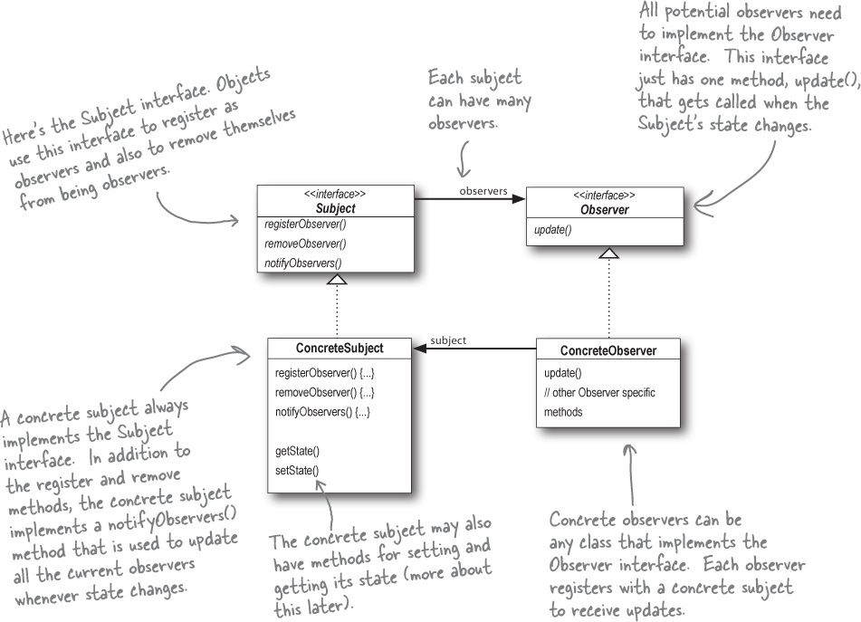
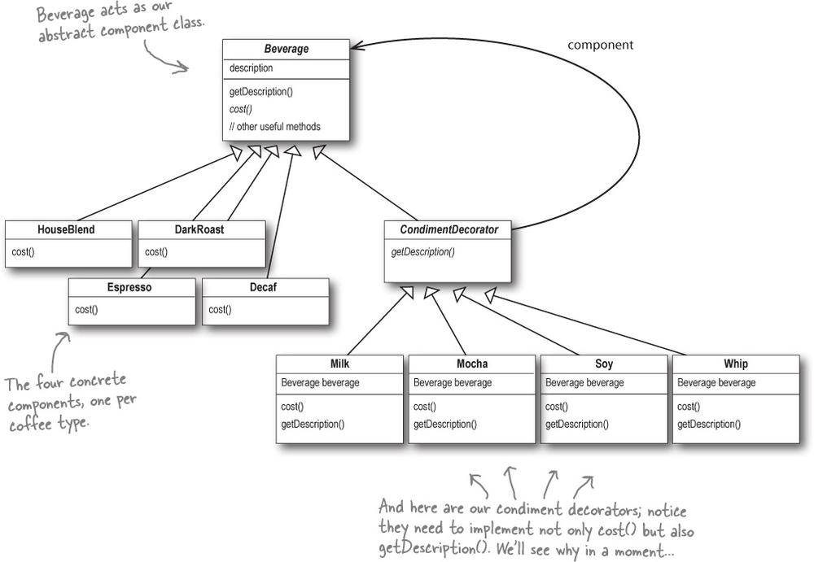
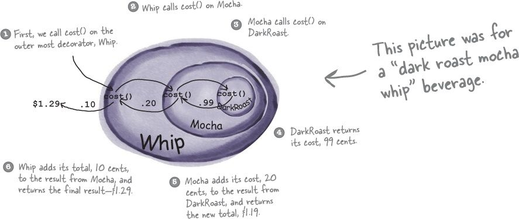

# Padrões de projeto 
## Strategy 
O padrão Strategy define uma família de algoritmos, encapsula cada um e os fazem intercâmbiaveis. 
Strategy deixa o algoritmo variar independente dos clientes que o usam 

##### [Príncipios de padrões] Identify the aspects of your application that vary and separate them from what stays the same.
- Separe da classe Quack os QuackBehavios e FlyBehavios 

##### [Príncipios de padrões] Program to an interface, not an implementation.
- A classe Duck não precisa saber os detalhes de implementação de seus próprios comportamentos. Criamos interfaces QuackBehavios  e FlyBehavios  e classe que implementam essas interfaces 

##### [Príncipios de padrões] Favor composition over inheritance.
- A classe Duck TEM-UM FlyBehavior pode ser melhor do que RocketDuck é um Duck   

## Observer Pattern
O Observer Pattern  define uma dependencia one-to-many entre os objetos para que quando um objeto mudar o seu estado, todos seus dependentes sejam notificados e atualizados automaticamente. 

##### [Príncipios de padrões] Strive for loosely coupled designs between objects that interact.
No padrão observer tanto o observador(assinante) quanto sujeito(editora) podem sofrer mudanças de forma que um não afeta o outro
o observador precisa saber apenas que o sujeito implementa uma interface 'subject' e o sujeito precisa apenas 
saber que o observador implementa a interface 'observer' e como registrar um novo observador na sua lista de observadores 

### Como o Observer Pattern aplica os alguns príncipios de padrões de projeto . 
**Identify the aspects of your application that vary and separate them from what stays the same.**

` The thing that varies in the Observer Pattern       
  is the state of the Subject and the number and     
  types of Observers. With this pattern, you can      
  vary the objects that are dependent on the state    
  of the Subject, without having to change that       
  Subject. That’s called planning ahead!`

**Program to an interface, not an implementation.**

` Both the Subject and Observer use interfaces.      
  The Subject keeps track of objects implementing    
  the Observer interface, while the observers         
  register with, and get notified by, the Subject       
  interface. As we’ve seen, this keeps things nice and      
  loosely coupled.     `  
  
  **Favor composition over inheritance.** 
  
`   The Observer Pattern uses composition to compose  
    any number of Observers with their Subjects.        
    These relationships aren’t set up by some kind of     
    inheritance hierarchy. No, they are set up at     
    runtime by composition!`
	
## Decorator Pattern 	

 O  principio básico do Decorator pattern é a adição de camadas a um determinado objeto que irão adicionar um determinado comportamento em runtime.
 Sendo assim não é necessario ficar adicionando novo código sempre que surgir num novo comportamento.   
 

 
 
 * [código que ilusta o decorrator pattern](https://github.com/guilhermeNatan/dessingpatterns/tree/master/src/decorator);
 * [explicação com imagens do código exemplo](imagens/decoratorpatterexplicacao.pdf)
  
 IMPORTANTE: O decorator pattern pode ser um padrão mais complexo de se identificar, o que vale é sempre nos preocuparmos 
 em indentivar as partes do projeto que vale a pena aplicar um determinado pardrão e assim o fazer. 
 
 
 ##### [Príncipios de padrões] Classes should be open for extension, but closed for modification.
  open: Feel free to extend our classes with any new behavior you like. If your needs or requirements change (and we know they will), just go ahead and make your own extensions.
  closed: That’s right, we spent a lot of time getting this code correct and bug free, so we can’t let you alter the existing code. It must remain closed to modification
  
 

#### Alguns cuidados com Decorator Pattern 
 - Pode introduzir uma grande quantidade de classes pequenas no código, o que pode almetar a complexidade de entendimento do código
 - Normalmente você pode inserir decoradores de forma transparente e o cliente nunca precisa saber que está lidando com um decorador, mas pode haver trechos de código 
 que dependem de um tipo especifico e isso pode ser um problema quando vc começa introduzir decoradores. 
 - A introdução de decoradores pode aumentar a complexidade do código necessário para instanciar o componente. Depois de ter decoradores, 
 você precisa não apenas instanciar o componente, mas também envolvê-lo com quem sabe quantos decoradores.